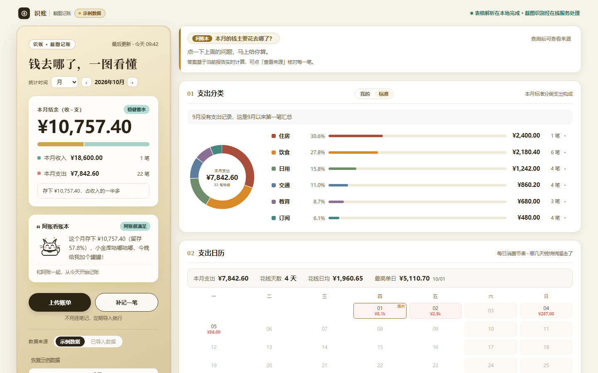
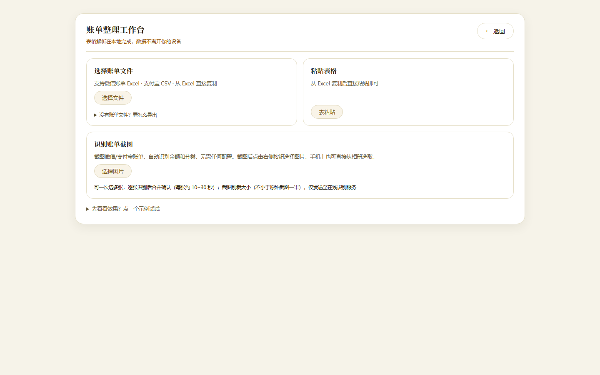

# 识账｜不用逐笔记，定期导入看收支

**[在线体验识账 →](https://shizhang-demo.app.workbuddy.host/)** · 免费使用 · 不用注册 · 不用安装

先用内置示例试试，觉得顺手再导入自己的账单。需要导出备份，建议从一开始就用手机或电脑的系统浏览器打开。

这是我花了一个月做的记账工具——识账。平时不用每次消费后记一笔，隔一段时间导入账单，集中核对，再看钱花在哪。

## 它能帮你省哪些操作？

- **一次整理一份账单**：支持微信、支付宝官方账单表格，也可以粘贴表格内容。不方便导出表格时，可以选择账单截图识别，核对后入账。
- **同类一起确认**：同一家店的多笔待分类记录，选一次分类就能一起应用，不用逐笔重复点。
- **按自己的习惯分类**：比如把房租、酒店归到“旅居”，设置规则后重新整理已有账单；手动改过的分类默认保留。
- **退款抵扣原支出**：能匹配原消费的退款自动抵扣，匹配不清楚的由你确认，避免把已退回的钱继续算作支出。

## 第一次使用

1. 打开上面的体验链接，先看内置示例。
2. 点「上传账单」，放入表格、粘贴内容或选择截图。
3. 核对待确认的分类、退款等事项，点「确认导入到账本」。
4. 回到首页看收支；有疑问，打开交易明细核对。

**[查看完整使用手册](./docs/使用手册.md)**

## 账单怎么处理、怎么保存？

表格里的账单信息不用上传，在你的手机或电脑上就能整理。截图识别会把图片发送到在线识别服务，每天最多识别5张，实际开始识别后计数，失败也会占用次数。

账目保存在你用来打开识账的浏览器里。换设备、换浏览器或清理网站数据前，请分别导出账目和备份设置，并保留原始官方账单。微信和系统浏览器各自保存账目，转过去不会自动带走账本。

## 当前需要知道的限制

- 导入自己的账单后，暂不能手动补记现金消费；更新账目需要继续导入新账单。
- 微信内可以打开和导入，但下载账目备份会提示转到系统浏览器；建议一开始就在系统浏览器使用。
- TSV导出保存账目、金额与分类，JSON备份保存支持的个人设置；两者都不是包含全部历史的完整应用备份。
- 截图识别结果需要核对。含高度敏感信息的账单，建议改用本地表格导入。

## 反馈

欢迎在本项目的Issues中反馈：用了什么设备和浏览器、做了哪一步、发生了什么、希望怎样。请不要公开上传自己的账单、交易单号、联系人或未遮挡的截图。

也可以在微信公众号「图图先看看」留言或回复「反馈」。使用识账不要求关注公众号或GitHub账号。

## 关于这个项目页

这里提供识账的产品介绍、使用说明和示例界面图片。识账应用继续通过上方链接在线使用，本仓库不提供应用源码。
