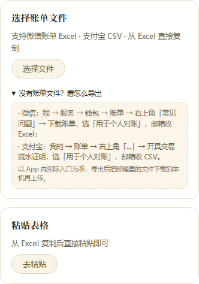

# 识账｜产品使用手册（入门与操作指引）

版本适用：识账 v145w（2026-10-05核对）  
体验地址：https://shizhang-demo.app.workbuddy.host/  
可以先按下面四步上手，再按需要查找具体操作。

## 第一次使用，四步上手

1. **放入账单**：点首页「上传账单」，选择表格文件、粘贴表格内容，或选择账单截图。
2. **核对待确认项**：工作台会集中列出需要你决定的分类、退款等事项。
3. **确认导入**：处理完待确认项后，点「确认导入到账本」。
4. **看收支**：回到首页看收支、分类和支出日历，有疑问再查交易明细。

---

## 目录
1. 快速了解：记账逻辑与数据环境
2. 方式选择：表格文件、直接粘贴或账单截图
3. 若使用表格：如何从微信/支付宝导出官方账单
4. 工作台处理：自动预整理与待确认明细
5. 同类一起确认，减少重复操作
6. 个人分类偏好与新建自定义分类
7. 看懂收支看板、支出日历与查账
8. 导出账目、备份设置与换设备
9. 设置项说明、当前限制与常见问题

---

## 1. 快速了解：记账逻辑与数据环境

如果习惯每次消费后记一笔，一忙起来容易忘，事后补记也难确认有没有记全。

识账采用**“定期整理”**的逻辑：平常不需要逐笔记；隔一段时间（如每周或月底），把微信、支付宝官方生成的对账单导出导入，或者把手头的账单截图选入识别；系统自动整理，你集中核对待确认项目，即可生成收支看板。

> **数据环境说明**：
> - **示例与真实账本隔离**：首次打开展示的是内置的“示例数据”（顶栏带有“示例数据”徽标）。导入你的账单后，页面会自动切换为你自己的真实账本，两者数据独立存储互不影响。
> - **表格在本地处理**：表格在浏览器里解析和统计，账本保存在当前浏览器中，不上传表格内容到后台服务器。
> - **截图识别经在线服务**：上传截图识别时，图片在本地压缩后发送至在线大模型识别服务处理。

---

## 2. 方式选择：表格文件、直接粘贴或账单截图

在首页点击醒目的 **「上传账单」** 按钮（下方小字提示“不用逐笔记，定期导入就行”），即可进入“账单整理工作台”。

*图：账单整理工作台三卡片入口与示例区*

工作台提供了三种输入方式，根据你的手头素材选择：

### 方式一：选择账单文件（推荐整月整理）
- 点击“选择账单文件”卡片或直接将文件拖拽进来；
- 支持格式：微信官方账单 Excel（`.xlsx`）、支付宝官方账单 CSV（`.csv`，已支持 gb18030 / UTF-8 编码自动识别）、识账此前导出的备份文件（`.tsv`）。

### 方式二：粘贴表格内容
- 如果账单已经在电脑的 Excel 或网页表格中打开，可以直接复制多行数据，点击“粘贴表格”卡片，将文本粘贴到输入框中开始整理。

### 方式三：识别账单截图（适合手头已有账单图片或不方便导出表格时）
- 点击“识别账单截图”卡片中的“选择图片”（手机端可直接从相册选取）；
- 支持格式：PNG、JPEG、WebP 格式的账单详情截图；
- **知情同意与隐私**：发送至在线服务前，系统会弹出知情同意弹层，告知截图将发送至在线识别服务；如截图包含高度敏感的个人信息，建议改用本地表格导入；
- **单张与多张队列**：支持一次选取多张截图，系统会进入队列逐张识别（页面提示约 10~30 秒，实际受网络和服务状态影响）；若某张识别失败会跳过并提示，识别成功的项目合并进入待确认区统一核对；
- **配额**：每天最多识别 5 张截图，按自然日计算，次日自动重置；分多次选图也累计，计数保存在当前浏览器本地。
- **计数方式**：每张图片实际开始识别时扣 1 次，识别失败也不退回。一次选多张时，只识别当天剩余张数，超出的跳过并提示，不扣次；取消后还未开始识别的图片、尺寸被拦下的图片，以及识别组件未加载时，都不扣次。

> **零成本体验**：如果手头暂时没有账单，可点击下方的“先看看效果？点一个示例试试”展开，选择微信样本、支付宝样本或退款场景样本直接体验完整流程。

---

## 3. 若使用表格：如何从微信/支付宝导出官方账单

如果你选择表格导入，需要先在手机微信或支付宝中导出官方的对账文件：

*图：工作台内置的官方导出路径指引*

### 微信账单导出路径
1. 打开手机微信，进入 **「我」→「服务」→「钱包」**；
2. 点击右上角 **「账单」**；
3. 点击右上角 **「常见问题」**，选择 **「下载账单」**；
4. 选择 **「用于个人对账」**；
5. 选择时间范围，输入接收邮箱；
6. 微信会发送一份包含 Excel（`.xlsx`）表格的压缩邮件，下载解压后即可上传。

### 支付宝账单导出路径
1. 打开手机支付宝，进入 **「我的」→「账单」**；
2. 点击右上角 **「…」**（三个点），选择 **「开具交易流水证明」**；
3. 选择 **「用于个人对账」**；
4. 选择时间范围，填入接收邮箱；
5. 支付宝会将账单压缩包发送至邮箱，解压后得到 `.csv` 表格即可上传。

> **提示**：具体菜单层级以官方 App 最新版本为准；导出后将邮件里的文件下载到本机再上传。

---

## 4. 工作台处理：自动预整理与待确认明细

放入文件或完成截图识别后，系统会在本地自动整理：
- **交易去重**：同一账单重复导入会自动跳过；跨文件相同交易会识别为已有记录；
- **自动分类建议**：内置词表根据商品说明和交易对方自动给出预分类建议；
- **退款自动抵扣**：退款自动关联默认开启，符合匹配规则的退款会关联原付款并扣减原支出金额；多次部分退款可以累计冲减，匹配不清或金额冲突需要确认；
- **非收支归入**：系统结合原账单的收支性质和解析规则整理理财、充值提现、还款、转账等记录；有些记录会先归入“不计收支”。若与你的实际记账口径不同，可在明细里核对后调整。

不能完全自动判定的事项，会集中展示在 **「待确认」** 区。必须处理完待确认项，底部的 **「确认导入到账本」** 按钮才会激活。

---

## 5. 同类一起确认，减少重复操作

为了避免每笔都逐个点击，工作台设计了多种成组与批量机制：

1. **同一商家的待分类记录**：
   - 当同一商家有多笔未分类支出时，系统会聚合成卡片；
   - 可以在卡片中选择“统一分类”，点击 **「应用到这 N 笔」** 一次性指定；如果不想一起处理，点击 **「稍后逐笔处理」** 即可。
2. **支付平台批量确认**：
   - 多张截图未认出支付平台时，卡片提示“有 N 笔没认出是哪个平台的账单——这些截图都是同一个 App 的吗？”；
   - 可直接点击 **「都是微信」** 或 **「都是支付宝」** 一键全部补齐；如果截图来自不同平台，点击 **「不是同一个，逐笔处理」** 展开单独选择。
3. **渠道消费批量调整**：
   - 符合条件的小荷包等渠道消费，原账单可能记作“不计收支”。先核对你想按实际消费记账，还是已经在充值或转出时记过支出，避免把同一笔资金重复计算；
   - 系统出现卡片提示，可点击 **「这 N 笔算作支出」** 一起转为支出统计，或点击 **「保持不计收支，逐笔处理」** 保持原状态。
4. **退款确认组**：
   - 当系统发现退款与原消费存在潜在对应关系时，会将原付款与退款合并显示为“退款确认组”；
   - 先核对原付款与退款金额，再按实际情况选择按钮：
     - 全额退款：**「是，已全额退回」**；
     - 部分退款：**「是，退了 ¥X.XX」**；金额更新时：**「按新额 ¥X.XX 确认」**；
     - 原付款选错、有其他流水可选时：**「不是这笔，重新选择」**；
     - 还拿不准：**「暂时不确定」**；金额需要调整：**「退款金额不对？修改」**。
   - 确认后，退款将直接冲减原消费金额（原支出变为净额），不会生成一笔虚高的独立收入行。
5. **勾选批量应用**：
   - 在待确认列表中，勾选多条记录后，可以通过底部的批量应用栏统一指定分类。

> **注意**：一起确认只是省去重复点选，每笔消费仍分别入账，不会合成一笔。退款确认组则把退款抵扣到原付款，按抵扣后的金额计算支出。

---

## 6. 个人分类偏好与新建自定义分类

识账支持按照你个人的生活习惯来组织分类：

只改某笔分类，用账目旁的「✎」；想按自己的习惯设置分类规则，再到设置里配规则。

### 1. 设置个人分类偏好（设置 → 分类偏好）
点击页面齿轮打开“设置”，在“分类偏好”文本框中每行填写一条规则：
- **只写纯词**（如 `旅居`、`数码`）：该词会作为你的个性大类，并在截图识别时作为提示词参考（但不保证模型一定完全分对）；
- **写关键词规则**（如 `旅居=房租/民宿/酒店`）：定义该分类包含哪些关键词。

### 2. 按偏好重算已有账单
- 配置好规则后，点击下方的 **「按偏好重算已有账单」** 按钮；
- 系统会弹出确认弹层，**先给出统计预告**（预计重算几笔、手动纠正保护几笔、未命中几笔）；
- **保护机制**：重算默认会**自动跳过你此前手动指定或纠正过的账目**，未命中的记录维持原分类不变。

### 3. “我的 / 标准”图表口径切换
- 在配置了分类偏好后，首页支出分类环形图右上角会出现 **「我的 / 标准」** 切换按钮；
- **重要说明**：这**只换图表的分组方式，不改账目底层的分类数据**。

### 4. 给账目指定新分类

- **只改一笔**：点击该笔账目旁的 **「✎」**，在分类选择中点 **「自定义…」**，输入新分类名称后确认。退款行不提供该修改入口。
- **一起改多笔**：
  1. 在首页打开 **「查看全部账目」**；
  2. 勾选想要归类的支出记录；
  3. 点击底部的 **「批量改分类」**；
  4. 输入新的自定义分类名称并应用。

设置里的“分类偏好”用于配置分类规则；要直接改某笔账目的分类，用上面的入口。

---

## 7. 看懂收支看板、支出日历与查账

账目导入后，回到主页即可查看完整的分析看板：

- **核心指标柱**：顶部展示当前所选统计范围的 **结余**（结余 = 收入 - 支出）、**收入**、**支出**；可以切换日、周、月或全部范围查看；
- **支出分类环形图**：直观展示各类消费占比，悬浮可看金额，右上角支持“我的/标准”口径切换；
- **支出日历**：按周一起始的月历视图，哪天花了多少钱一清二楚；
- **最近账目与来源追溯**：
  - 点击账目列表右侧的 **「›」** 箭头，可展开查看原始交易信息（支付渠道、原始交易单号、商品原始说明等）；
  - 单笔纠正分类：点击账目旁的 **「✎」**，手动修改后该记录会被打上保护标记；已导入账本的收入、转账或不计收支记录也可从该入口修改收支性质，退款行不提供此入口；
- **问账本**：
  - 点击横幅中的 **「问账本」** 标签；
  - 从预设问题中选择想查的内容，例如“这个月钱主要花去哪了”，查看结果后可以展开对应交易核对。当前不支持任意输入问题或自由聊天。

---

## 8. 导出账目、备份设置与换设备

### 1. 先选好浏览器，再保存账本
账本保存在当前浏览器中，通常下次用同一浏览器打开还能继续使用。**需要导出备份，建议从一开始就用系统浏览器打开识账。** 微信内可以导入，但下载 TSV 账目文件时会提示转到系统浏览器，微信里的账本不会自动带过去。

在清理网站数据、重装系统、换浏览器或换设备前，分别保存下面两份备份，重要账单另留原文件。

### 2. 导出账目（TSV）
先导入自己的账单，设置里才会显示「导出数据」；示例模式不显示。

- 点击首页齿轮进入 **「设置」**，在 **「已导入数据」** 区域点击 **「导出数据」**；
- 下载得到一份带时间戳的 `.tsv` 账目文件，保存账目、金额与分类。

### 3. 备份设置（JSON）
在 **「设置」** 中点击 **「备份设置」**，保存下载的 JSON 文件。它保存分类偏好、主题、退款自动关联开关等支持的个人设置，不包含账目。

### 4. 换设备或浏览器后恢复
1. 在新设备或新浏览器打开识账，点击 **「上传账单」**，导入之前保存的 TSV 账目文件；
2. 进入 **「设置」→「恢复设置」**，选择之前保存的 JSON 文件；恢复成功后页面会刷新。

TSV 中已抵扣退款的账目按当前有效金额保存，导入后恢复表中的账目、金额与分类并重算收支；它不完整保留原始退款关联历史。TSV 和 JSON 需要分别保存，两者都不是包含全部应用历史的完整备份。原始微信、支付宝账单也建议保留，方便核对。

如果已经在微信里整理，转到系统浏览器不会自动迁移账本。重新导入原始账单，需要重新核对分类与退款，也不会恢复微信里人工修改的分类或退款关联。具体情况见下方常见问题 Q1。

---

## 9. 设置项说明、当前限制与常见问题

### 1. 设置项说明
点击齿轮图标进入设置：
- **显示模块开关**：支持自定义勾选是否在看板显示 **支出分类**、**时薪换算**、**订阅雷达**、**结余留存** 四个模块；
- **主题外观**：支持切换 **「暖阳麦浪」** 与 **「苍葭草木」**；
- **退款自动关联**：默认开启。导入自己的账单后，进入 **「设置」→「退款自动关联」**，面板内的开关是 **「自动关联退款（推荐）」**。关闭后，新导入的退款不再自动配对，匹配与抵扣交给你确认；已关联的账目保持不变。重新开启对新导入即时生效，已有账本在下次打开页面时补齐自动关联。
- **查看与解除关联**：在同一面板查看已自动抵扣的退款清单；发现某笔抵扣不合适时，点击 **「解除关联」**，还原原支出金额，该退款不会再被自动配对。

### 2. 当前功能限制
- **时薪换算计算口径**：看板的时薪换算目前按固定示例时薪 ¥68.5/小时将总支出折算为工作时间，不代表个人实际收入换算；
- **订阅雷达功能状态**：按账本中已有“订阅”分类进行汇总统计；自动识别订阅功能尚未开放（页面提示“自动识别尚未开放”）；
- **已导入账本暂不支持手动补记**：「补记一笔」目前只写入示例账本。在已导入账本中，按钮仍可点击，但会提示暂不支持并建议上传新账单更新，不会新增流水。

### 3. 常见问题解答

**Q1：微信内直接打开能正常使用吗？**  
**答**：可以在微信里打开并导入账单，但微信内下载 TSV 会被拦截，提示转到系统浏览器。两个浏览器分别保存数据，**转过去不会带走微信里的账本**。如果需要导出备份，建议从一开始就用系统浏览器打开识账并整理账单。

如果已经在微信里整理，请先保留微信中的数据。到系统浏览器重新导入原始账单，只是重新整理，**不能恢复微信里人工修改的分类或退款关联**；只有已经保存的 TSV 备份，才能按上一节说明恢复其中的账目、金额与分类。

**Q2：导入同一份账单会重复记账吗？**  
**答**：系统具备同文件与同单号去重机制。同文件再次导入或跨文件遇到相同交易单号，不会再新增同一笔交易；没有单号、但内容相似的记录可能进入“疑似重复”待确认，需要你核对。交易状态变化或退款冲突也可能需要确认。

**Q3：遇到问题如何反馈？**  
**答**：在微信公众号 **「图图先看看」** 后台直接留言，或者发送关键词 **「反馈」**。反馈时请注明使用的设备、浏览器类型以及卡住的具体步骤。
